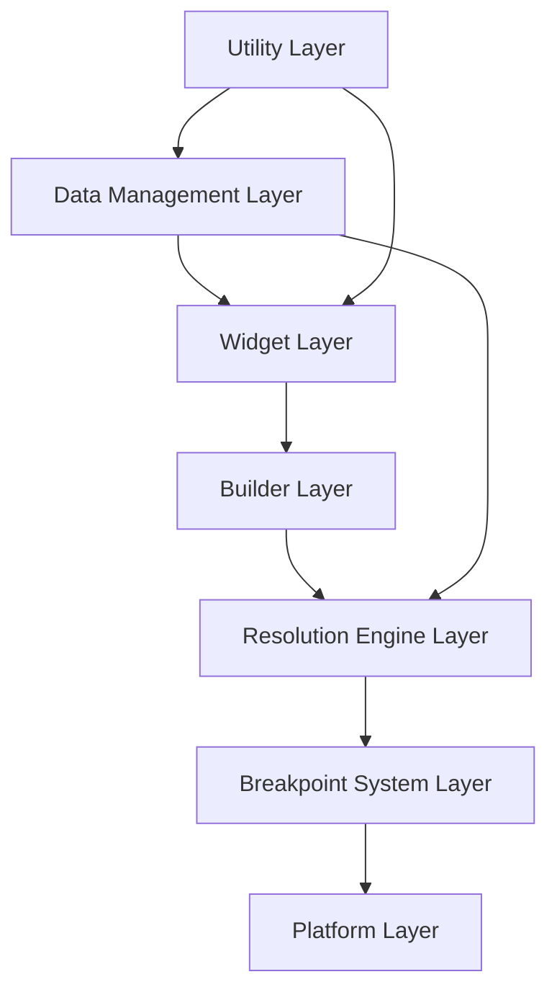

# responsive_size_builder Architecture Documentation

## Overview

The `responsive_size_builder` package is a comprehensive Flutter library that provides a sophisticated system for building responsive user interfaces that adapt to different screen sizes and device types. The package implements a multi-tier architecture with both standard (5-category) and granular (13-category) breakpoint systems, enabling precise control over responsive layouts across the entire spectrum of modern devices, from smartwatches to ultra-wide monitors.

## Architecture Style

- **Pattern**: Layered Architecture with Provider Pattern and Inherited Widget System
- **Key Technologies**: Flutter SDK, Dart Enums, InheritedModel, LayoutBuilder
- **Design Paradigm**: Responsive-first with Fallback Resolution Strategy

## Directory Structure

```
/responsive_size_builder
├── lib/
│   ├── responsive_size_builder.dart    # Main library export file
│   └── src/                           # Core implementation modules
│       ├── breakpoints.dart           # Breakpoint definitions and enums
│       ├── breakpoints_handler.dart   # Core breakpoint resolution logic
│       ├── screen_size_builder.dart   # Widget-based responsive builders
│       ├── screen_size_data.dart      # Screen size data models and providers
│       ├── layout_size_builder.dart   # Layout constraint-based builders
│       ├── responsive_value.dart      # Responsive value providers
│       ├── value_size_builder.dart    # Value-based responsive builders
│       ├── layout_constraints_provider.dart # Layout constraint utilities
│       ├── overlay_position_utils.dart # Overlay positioning utilities
│       ├── screen_size_with_value.dart # Enhanced screen size provider
│       └── utilities.dart             # Platform detection utilities
├── example/                          # Example application and demos
└── test/                            # Unit and integration tests
```

## Component Overview

### Component 1: Breakpoint System
- **Location**: `/lib/src/breakpoints.dart`
- **Responsibility**: Defines responsive breakpoint thresholds and size categorizations
- **Key Functions**:
  - `BaseBreakpoints<T>` - Abstract breakpoint contract
  - `Breakpoints` - Standard 5-tier breakpoint system (extraSmall, small, medium, large, extraLarge)
  - `BreakpointsGranular` - Granular 13-tier system with jumbo/standard/compact/tiny categories
  - `LayoutSize` and `LayoutSizeGranular` enums for type-safe size categorization
- **Dependencies**: Flutter Foundation

### Component 2: Breakpoint Resolution Engine
- **Location**: `/lib/src/breakpoints_handler.dart`
- **Responsibility**: Core logic for mapping screen dimensions to appropriate values using intelligent fallback strategies
- **Key Functions**:
  - `BaseBreakpointsHandler<T, K>` - Abstract resolution engine with caching and change notifications
  - `BreakpointsHandler<T>` - Standard 5-tier resolution implementation
  - `BreakpointsHandlerGranular<T>` - Granular 13-tier resolution implementation
  - Intelligent fallback resolution (Direct Match → Fallback Search → Last Resort)
  - Performance optimization through caching and change detection
- **Dependencies**: Breakpoint System, Flutter Material

### Component 3: Screen Size Data Management
- **Location**: `/lib/src/screen_size_data.dart`
- **Responsibility**: Captures and provides screen size information throughout the widget tree
- **Key Functions**:
  - `ScreenSize<T>` - Root widget that monitors screen dimensions and breakpoints
  - `ScreenSizeModel<T>` - InheritedModel for efficient data propagation
  - `ScreenSizeModelData<K>` - Immutable data class containing comprehensive screen metrics
  - `ScreenSizeAspect` - Optimization aspects for selective widget rebuilding
- **Dependencies**: Breakpoint System, Flutter UI

### Component 4: Widget-Based Responsive Builders
- **Location**: `/lib/src/screen_size_builder.dart`
- **Responsibility**: Provides widget builders that adapt based on screen size breakpoints
- **Key Functions**:
  - `ScreenSizeBuilder` - Standard responsive widget builder with screen size data
  - `ScreenSizeOrientationBuilder` - Orientation-aware builder with separate portrait/landscape builders
  - `ScreenSizeBuilderGranular` - Fine-grained builder with 13 breakpoint categories
  - `ScreenSizeWidgetBuilder` - Type definition for responsive builder functions
- **Dependencies**: Breakpoint Resolution Engine, Screen Size Data Management

### Component 5: Layout Constraint-Based Builders
- **Location**: `/lib/src/layout_size_builder.dart`
- **Responsibility**: Responsive builders that work with Flutter's BoxConstraints rather than overall screen size
- **Key Functions**:
  - `LayoutSizeBuilder` - Standard constraint-based responsive builder
  - `LayoutSizeGranularBuilder` - Granular constraint-based builder with enhanced context
  - Integration with Flutter's LayoutBuilder for constraint-aware responsive design
- **Dependencies**: Breakpoint Resolution Engine, Screen Size Data Management

### Component 6: Responsive Value System
- **Location**: `/lib/src/responsive_value.dart`
- **Responsibility**: Provides responsive values that automatically change based on screen size breakpoints
- **Key Functions**:
  - `BaseResponsiveValue<T, V>` - Abstract base for responsive value providers
  - `ResponsiveValue<V>` - Standard 5-tier responsive value implementation
  - `ResponsiveValueGranular<V>` - Granular 13-tier responsive value implementation
- **Dependencies**: Breakpoint Resolution Engine

### Component 7: Value-Based Responsive Builders
- **Location**: `/lib/src/value_size_builder.dart`
- **Responsibility**: Widget builders that return typed values instead of widgets for responsive design
- **Key Functions**:
  - `ValueSizeBuilderGranular<K>` - Granular value-based responsive builder
  - Generic type support for any value type (Widget, double, int, String, custom types)
  - Intelligent fallback resolution across 13 granular categories
- **Dependencies**: Breakpoint Resolution Engine, Screen Size Data Management

### Component 8: Layout Constraint Utilities
- **Location**: `/lib/src/layout_constraints_provider.dart`
- **Responsibility**: Utilities for propagating BoxConstraints through the widget tree
- **Key Functions**:
  - `LayoutConstraintsProvider` - InheritedWidget for constraint propagation
  - `LayoutConstraintsWrapper` - Convenience widget combining LayoutBuilder with constraint provision
- **Dependencies**: Flutter Widgets

### Component 9: Overlay Positioning System
- **Location**: `/lib/src/overlay_position_utils.dart`
- **Responsibility**: Calculates optimal positioning for overlays like tooltips and dropdowns
- **Key Functions**:
  - `getWidgetSpacing<T>()` - Analyzes widget position and calculates available space
  - `WidgetSpacing` - Immutable data class with comprehensive spacing calculations
  - `constraintsVertical()` and `onstraintsHorizontal()` - Optimal positioning constraint calculation
  - `HorizonatalDirection` and `VerticalDirection` enums for directional positioning
- **Dependencies**: Screen Size Data Management

### Component 10: Enhanced Screen Size Provider
- **Location**: `/lib/src/screen_size_with_value.dart`
- **Responsibility**: Extended screen size provider that includes responsive values
- **Key Functions**:
  - `ScreenSizeWithValue<T, V>` - Enhanced provider combining screen size data with responsive values
  - `ScreenSizeModelWithValue<T, V>` - InheritedModel for enhanced data propagation
  - `ScreenSizeModelDataWithValue<K, V>` - Extended data class with responsive values
- **Dependencies**: Screen Size Data Management, Responsive Value System

### Component 11: Platform Detection Utilities
- **Location**: `/lib/src/utilities.dart`
- **Responsibility**: Compile-time platform detection for responsive design
- **Key Functions**:
  - `kIsDesktopDevice` - Boolean constant for desktop platform detection
  - `kIsTouchDevice` - Boolean constant for touch-enabled device detection
- **Dependencies**: Flutter Foundation

## Component Interactions

The architecture follows a layered dependency model with clear separation of concerns:



### Interaction Flow

1. **Initialization**: `ScreenSize<T>` widget captures screen metrics and establishes breakpoint context
2. **Data Propagation**: `ScreenSizeModel<T>` propagates screen size data through InheritedModel pattern
3. **Breakpoint Resolution**: Handler classes use breakpoint definitions to map screen sizes to appropriate values
4. **Builder Selection**: Builder widgets use resolved breakpoints to select appropriate widget/value builders
5. **Fallback Resolution**: When exact matches aren't found, intelligent fallback logic searches for alternatives
6. **Optimization**: Caching and selective rebuilding minimize performance impact

## Architectural Patterns

### Primary Pattern: Layered Architecture
The system is organized into distinct layers with clear responsibilities:
- **Widget Layer**: User-facing builder widgets and providers
- **Resolution Layer**: Core breakpoint resolution and caching logic  
- **Data Layer**: Screen size data models and propagation mechanisms
- **Configuration Layer**: Breakpoint definitions and platform utilities

### Secondary Pattern: Provider Pattern
Uses Flutter's InheritedModel/InheritedWidget system for efficient data propagation:
- Selective rebuilding based on data aspects
- Automatic dependency tracking
- Memory-efficient data sharing

### Tertiary Pattern: Strategy Pattern
Breakpoint handlers use strategy pattern for different resolution approaches:
- Standard vs. Granular breakpoint strategies
- Different fallback resolution strategies
- Pluggable breakpoint configurations

## Code Organization Conventions

### File Naming
- **Pattern**: snake_case for all Dart files
- **Widgets**: `*_builder.dart` for widget builders, `*_data.dart` for data classes
- **Utilities**: `utilities.dart` for shared utilities, `*_utils.dart` for specific utility groups
- **Core Logic**: Descriptive names like `breakpoints_handler.dart`, `responsive_value.dart`

### Code Location Guide

| Code Type | Location | Example |
|-----------|----------|---------|
| Breakpoint Definitions | `/src/breakpoints.dart` | `Breakpoints`, `LayoutSize` enum |
| Widget Builders | `/src/*_builder.dart` | `ScreenSizeBuilder`, `LayoutSizeBuilder` |
| Data Models | `/src/*_data.dart` | `ScreenSizeModelData` |
| Resolution Logic | `/src/breakpoints_handler.dart` | `BreakpointsHandler<T>` |
| Utilities | `/src/utilities.dart`, `/src/*_utils.dart` | `kIsDesktopDevice`, `getWidgetSpacing` |
| Type Definitions | Throughout source files | `ScreenSizeWidgetBuilder` |

### Naming Conventions
- **Classes**: PascalCase with descriptive, domain-specific names
- **Functions/Methods**: camelCase with verb-based naming
- **Constants**: camelCase with 'k' prefix for global constants
- **Enums**: PascalCase with descriptive value names
- **Generic Types**: Single uppercase letters (T for types, K for keys, V for values)

## Architectural Decisions

### ADR-001: Dual Breakpoint System Design
- **Date**: 2024-11-XX
- **Status**: Accepted
- **Context**: Need to support both simple responsive design (5 categories) and complex enterprise scenarios (13+ categories)
- **Decision**: Implement dual breakpoint system with standard (5-tier) and granular (13-tier) options
- **Consequences**: 
  - **Positive**: Supports simple and complex use cases, maintains type safety
  - **Negative**: Increased API surface area, more complex documentation needs

### ADR-002: InheritedModel for Data Propagation
- **Date**: 2024-11-XX
- **Status**: Accepted
- **Context**: Need efficient data propagation with selective rebuilding
- **Decision**: Use InheritedModel with aspect-based dependency tracking
- **Consequences**:
  - **Positive**: Optimal rebuild performance, standard Flutter pattern
  - **Negative**: Additional complexity in model implementation

### ADR-003: Intelligent Fallback Resolution Strategy
- **Date**: 2024-11-XX
- **Status**: Accepted
- **Context**: Need robust handling when exact breakpoint matches aren't available
- **Decision**: Implement three-tier fallback: Direct Match → Smaller Size Search → Last Resort
- **Consequences**:
  - **Positive**: Prevents runtime errors, enables flexible API design
  - **Negative**: More complex resolution logic, potential for unexpected fallbacks

### ADR-004: Generic Type System for Values
- **Date**: 2024-11-XX
- **Status**: Accepted
- **Context**: Need to support responsive values of any type (Widget, double, int, custom objects)
- **Decision**: Use generic type parameters throughout the system
- **Consequences**:
  - **Positive**: Type safety, flexibility for any value type
  - **Negative**: More complex API signatures, steeper learning curve

## Getting Started

Quick guide for developers to understand the architecture:

1. **Understand the Breakpoint System**: Start with `breakpoints.dart` to understand how screen sizes are categorized
2. **Grasp the Resolution Engine**: Study `breakpoints_handler.dart` to understand how breakpoints map to values
3. **Explore Builder Widgets**: Examine `screen_size_builder.dart` to see how responsive widgets are constructed
4. **Learn Data Flow**: Follow data propagation through `ScreenSize` → `ScreenSizeModel` → Builder widgets
5. **Study Examples**: The `/example` folder demonstrates all major features and usage patterns

## Key Integration Patterns

### Basic Integration
```dart
// 1. Wrap your app with ScreenSize
ScreenSize<LayoutSize>(
  breakpoints: Breakpoints.defaultBreakpoints,
  child: MaterialApp(
    // 2. Use builders anywhere in the widget tree
    home: ScreenSizeBuilder(
      small: (context, data) => MobileLayout(),
      large: (context, data) => DesktopLayout(),
    ),
  ),
)
```

### Advanced Integration
```dart
// Granular responsive system with values
ScreenSizeWithValue<LayoutSizeGranular, int>(
  breakpoints: BreakpointsGranular.defaultBreakpoints,
  valueProvider: ResponsiveValueGranular<int>(
    compactLarge: 1,      // Mobile: 1 column
    standardLarge: 3,     // Desktop: 3 columns  
    jumboSmall: 5,        // Ultra-wide: 5 columns
  ),
  child: MyApp(),
)
```

## Maintenance

- **Owner**: responsive_size_builder development team
- **Last Updated**: 2024-12-06
- **Review Schedule**: Quarterly architecture reviews, continuous integration monitoring

## Extension Points

The architecture provides several extension points for custom implementations:

1. **Custom Breakpoint Systems**: Extend `BaseBreakpoints<T>` for domain-specific breakpoint logic
2. **Custom Resolution Handlers**: Extend `BaseBreakpointsHandler<T, K>` for specialized resolution strategies  
3. **Custom Responsive Values**: Extend `BaseResponsiveValue<T, V>` for complex responsive value providers
4. **Custom Builder Types**: Create specialized builders using the underlying handler system

This architecture documentation serves as a comprehensive guide for developers working with the responsive_size_builder package, providing both high-level understanding and detailed implementation guidance for building sophisticated responsive Flutter applications.